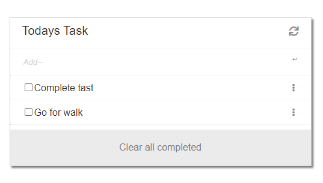

# JS ToDo List

 
## 👩🏼‍💻 About
This is project is for list ToDo. 

## 🔧 Built With
- JavaScript (Programming Language)
- HTML/CSS (Markup Language)
- Webpack
- JavaScript-CS6

## 🤖 Getting started

- In the desired directory, type `git clone https://github.com/abmAsadullah/js-todo.git` then `cd js-todo` in the terminal.

- Run `npm install`.

- Run `npm run server`.

- See your Brawser `http://localhost:3000/`.

## Author

👤 **A B M Asadullah**

- GitHub: [@abmAsadullah](https://github.com/abmAsadullah)
- Twitter: [@abmAsadullah](https://twitter.com/abmAsadullah)
- LinkedIn: [abmAsadullah](https://www.linkedin.com/in/abmAsadullah)

## 🤝 Contributing

Contributions, issues, and feature requests are welcome!

## ⭐ Show your support

Give a ⭐️ if you like this project!

## 📝 License

This project is [MIT](https://opensource.org/licenses/MIT) licensed.
